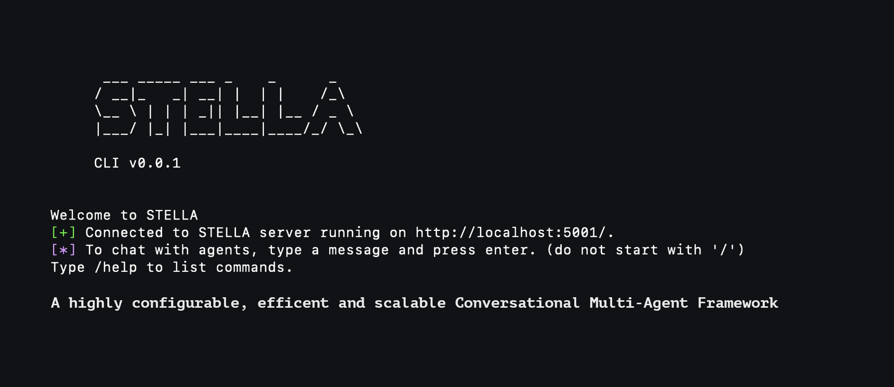

  

 —  —  — 

# Welcome to STELLA

### A Scalable Multi-Agent AI Framework

STELLA is a multi-agent framework for conversational agents using Large Language Models that focuses on scalability, broad capabilities, and powerful configuration. It simplifies incorporation of advanced LLM capabilities into applications, offering a server-based multi-agent framework solution that is powerful, efficient and scalable.

**🛠️ Status**: Beta - We're crafting the future.
STELLA is currently in beta. We are working hard to improve the framework and add new features. For questions or feedback, contact us at [contact@stellaframework.com](mailto:contact@stellaframework.com).

## 📚 Guide

- [🚀 Getting Started](#getting-started)
- [🔭 Introduction](https://docs.stellaframework.com/Introduction.html)
- [🤝 Contributing](https://docs.stellaframework.com/contribution_guidelines/index.html)
- [🌍 Community](https://docs.stellaframework.com/Community.html)
- [⚖️ Licensing](https://docs.stellaframework.com/Licensing.html)

### Quick Start

To set up STELLA:

1. **Clone the Repository**:
   - HTTPS: `git clone https://github.com/Norditech-AB/STELLA.git`
   - SSH: `git clone git@github.com:Norditech-AB/STELLA.git`
   - GitHub CLI: `gh repo clone Norditech-AB/STELLA`

2. **Create & Activate a Virtual Environment**:
   - `python -m venv venv`
   - `source venv/bin/activate`

2. **Install STELLA**:
   Run `pip install -e .` from the `root` folder to install STELLA CLI and its dependencies.

3. **Quickly Configure STELLA**:
   Run `stella configure` and follow the instructions.

4. **Start the Server**:
   Run `stella serve` from the `root` folder of the repository.

5. **Explore and Create**:
   Open a new terminal window and run `stella` from the `root` folder of the repository. This will open a Python shell with the STELLA environment loaded. You can now explore the framework and create your own agents.

For a complete guide, visit [Getting Started](https://docs.stellaframework.com/Getting_Started).

## Typical Use Cases:

- Automating workflows and tasks.
- Building digital workforces.
- Connecting APIs and services.
- Creating smart chatbots.
- Speeding up the development of LLM-powered applications.
- Finding patterns and trends in unstructured data.
- Creating content.

**Get started with our [Getting Started Guide](https://docs.stellaframework.com/Getting_Started).**

## Key Features

- **Server-based Architecture**: Solid foundation for large-scale applications.
- **Socket Communication**: Efficient real-time updates.
- **Multi-User Support**: Scalable for numerous users.
- **Configurability**: Expandable with minimal coding.
- **Speed Optimization**: Faster execution times.
- **Agent Intercommunication**: Reduces Token usage.
- **Single-Prompt Method**: Simple model support.
- **Command Line Interface**: Direct terminal access.
- **Community-Driven Package Manager**: Easy publication and installation of agents.

For detailed use cases, visit our [Use Cases page](https://docs.stellaframework.com/).

## LICENSE
STELLA offers two licensing options to accommodate diverse use cases. Both licenses are designed to meet different requirements, ensuring flexibility and convenience for all users.
- **AGPL-3.0 License:** This license is perfect for students and hobbyists. It's an [Open Source Initiative (OSI)-approved](https://opensource.org/licenses/) open-source license that encourages collaborative development and knowledge exchange. For detailed information, please refer to the LICENSE file.
- **Enterprise License:** Tailored for commercial purposes, this license allows for the integration of STELLA software into commercial products and services. This option is ideal for those who need to use our solutions in a commercial context without adhering to the open-source stipulations of the AGPL-3.0 license. For inquiries and more details about this license, please [contact us](mailto:philip@norditech.se).

## Community and Support

Join our community for support, discussions, and insights. Connect through our forums and support channels.

Visit the [Community section](https://docs.stellaframework.com/Community) to get involved.

## Next Steps

- Learn about agent creation in [Creating a new Agent](https://docs.stellaframework.com/agents/Creating_a_new_Agent).
- Explore CLI commands in the [CLI section](https://docs.stellaframework.com/cli/index).

---

STELLA is an evolving framework. We welcome contributions and feedback to improve and expand its capabilities.

