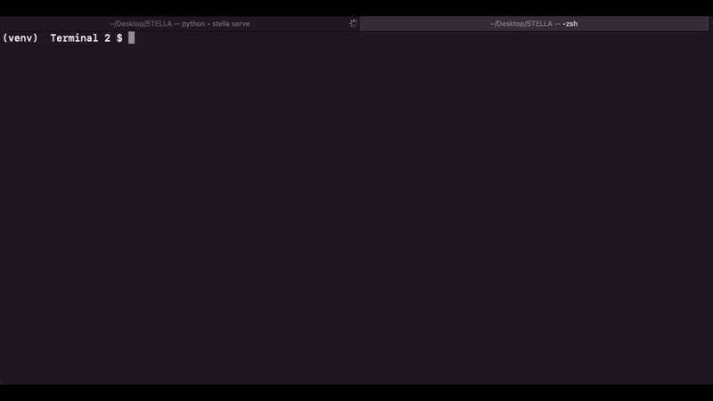
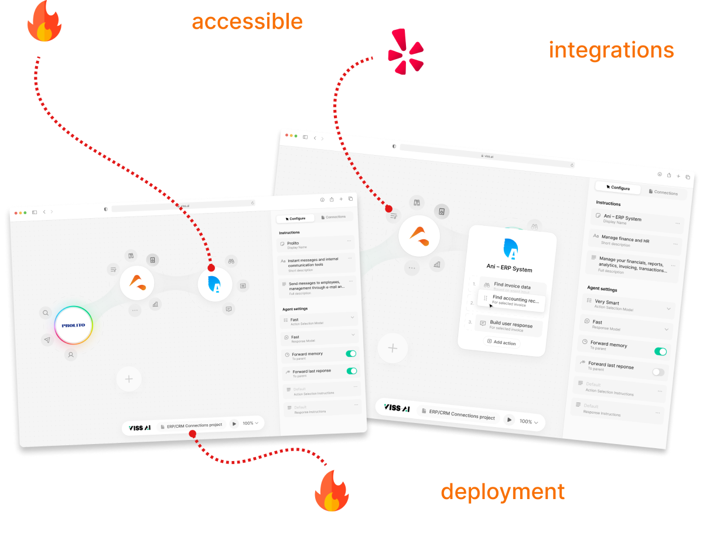

<div align="center">
  
</div>

<div align="center">

[](LICENSE) — [](https://github.com/Norditech-AB/STELLA/tree/main) — [](https://docs.stellaframework.com/Community.html) — [](https://docs.stellaframework.com/)

</div>

# Welcome to STELLA

### A Scalable Multi-Agent AI Framework

STELLA is a multi-agent framework for conversational agents using Large Language Models that focuses on scalability, broad capabilities, and powerful configuration. It simplifies incorporation of advanced LLM capabilities into applications, offering a server-based multi-agent framework solution that is powerful, efficient and scalable.

**🛠️ Status**: Beta - We're crafting the future.
STELLA is currently in beta. We are working hard to improve the framework and add new features. For questions or feedback, contact us at [contact@stellaframework.com](mailto:contact@stellaframework.com).

## 📚 Guide

- [🚀 Getting Started](https://docs.stellaframework.com/Getting_Started.html)
- [📖 Documentation](https://docs.stellaframework.com/)
- [🤝 Contributing](https://docs.stellaframework.com/contribution_guidelines/index.html)
- [🌍 Community](https://docs.stellaframework.com/Community.html)
- [⚖️ Licensing](https://docs.stellaframework.com/Licensing.html)
- [💫 VISS.AI - Accessible AI for all](#vissai---accessible-ai-for-all) (**COMING SOON** 🚀)


### Quick Start

To set up STELLA:

1. **Clone the Repository**:

```bash
git clone https://github.com/Norditech-AB/STELLA.git
```
```bash
git clone git@github.com:Norditech-AB/STELLA.git
```
```bash
gh repo clone Norditech-AB/STELLA
```

2. **Create & Activate a Virtual Environment**:

```bash
python -m venv venv
```
```bash
source venv/bin/activate
```

3. **Install STELLA**: Navigate to the root directory and run:
```bash
pip install -e .
```

4. **Quickly Configure STELLA** by following the instructions after running:

```bash
stella configure
```

5. **Start the Server** by running
 
```bash
stella serve
```

6. **Explore and Create**: Open a new terminal window and run
```bash
stella
```
This will open a Python shell with the STELLA environment loaded. You can now explore the framework and create your own agents.
Get started quickly writing `/register`.
To list available commands, write `/help` in the shell.

<div align="center">
  
</div>

For a complete guide, visit [Getting Started](https://docs.stellaframework.com/Getting_Started).

## Typical Use Cases:

- Automating workflows and tasks.
- Building digital workforces.
- Connecting APIs and services.
- Creating smart chatbots.
- Speeding up the development of LLM-powered applications.
- Finding patterns and trends in unstructured data.
- Creating content.

**Get started with our [Getting Started Guide](https://docs.stellaframework.com/Getting_Started).**

## Key Features

- **Server-based Architecture**: Solid foundation for large-scale applications.
- **Socket Communication**: Efficient real-time updates.
- **Multi-User Support**: Scalable for numerous users.
- **Configurability**: Expandable with minimal coding.
- **Speed Optimization**: Faster execution times.
- **Agent Intercommunication**: Reduces Token usage.
- **Single-Prompt Method**: Simple model support.
- **Command Line Interface**: Direct terminal access.
- **Community-Driven Package Manager**: Easy publication and installation of agents.

For detailed information, visit our [Documentation page](https://docs.stellaframework.com/).

## LICENSE
STELLA offers two licensing options to accommodate diverse use cases. Both licenses are designed to meet different requirements, ensuring flexibility and convenience for all users.
- **AGPL-3.0 License:** This license is perfect for students and hobbyists. It's an [Open Source Initiative (OSI)-approved](https://opensource.org/licenses/) open-source license that encourages collaborative development and knowledge exchange. For detailed information, please refer to the LICENSE file.
- **Enterprise License:** Tailored for commercial purposes, this license allows for the integration of STELLA software into commercial products and services. This option is ideal for those who need to use our solutions in a commercial context without adhering to the open-source stipulations of the AGPL-3.0 license. For inquiries and more details about this license, please [contact us](mailto:philip@norditech.se).

## Community, Support & Contributions

Join our community for support, discussions, and insights. Connect through our forums and support channels.

Visit the [Community section](https://docs.stellaframework.com/Community) to get involved and see the [Contribution Guidelines](https://docs.stellaframework.com/contribution_guidelines/index.html) to learn how to contribute to STELLA.

## Next Steps

- Learn about agent creation in [Creating a new Agent](https://docs.stellaframework.com/agents/Creating_a_new_Agent).
- Explore CLI commands in the [CLI section](https://docs.stellaframework.com/cli/index).

---

STELLA is an evolving framework. We welcome contributions and feedback to improve and expand its capabilities.

---

# VISS.AI - Accessible AI for all

<div align="center">
  
</div>

## Create AI-powered applications without writing a single line of code.
VISS.AI is a visual tool that allows you to create AI-powered applications without writing a single line of code. Integrate automatically towards APIs and services and create your own AI-powered applications in minutes.

Join the [🔗 VISS.AI Waitlist](https://viss.ai) to be the first to know when VISS.AI launches. Early access is being rolled out in batches.

<div align="center">
  
</div>

## How does it work?
- 🔗 **Simply connect your apps by clicking and dragging.** No coding required.
- 🗣️ Tell VISS.AI how your apps should interact with each other by describing your workflow.
- 🌍 Integrate automatically towards APIs and services.
- 🌟 Don't worry about data mapping, VISS.AI does it for you.
- 👨‍💻👩‍💻 Create your own AI-powered applications in minutes.
- 🚀 Deploy small or on scale with a single click.

<div align="center">
  
</div>

**Imagine a world where everyone can access the power of AI. VISS.AI is a STELLA-powered platform that makes this possible.**

Interesting? Watch the [🔗 VISS.AI Demo](https://www.youtube.com/watch?v=_c6GEbI1bjU) and join [🔗 the waitlist](https://viss.ai) to be the first to know when VISS.AI launches.